# MaxKB_Analysis 分析框架

<div align="center">

[](#)
[](#)
[](#)

</div>

## 📋 框架概述

MaxKB_Analysis 分析框架是一个系统化、多层次的开源项目质量评估体系，专为深入分析 [MaxKB](https://github.com/1Panel-dev/MaxKB) 知识库系统而设计。框架采用**四阶段递进式分析策略**，从数据、代码、安全、验证四个维度全面剖析开源项目的架构质量与潜在风险。

## 🎯 四阶段分析策略

### 🔴 第一阶段：仓库演化与社区画像分析 📊
**数据驱动分析** | 工具链：PyDriller、GitPython、Pandas、Matplotlib

深入挖掘 MaxKB 的发展轨迹和社区生态特征：

**核心分析内容：**
- **贡献者画像**：识别核心开发者，分析社区代码控制模式（集中式 vs 去中心化）
- **模块演化**：统计各功能模块修改频率，定位 Bug 热点区域
- **社区健康度**：计算 Issue 解决时效，评估维护团队响应效率
- **发展趋势**：分析提交活跃度变化，预测项目发展方向

**关键技术指标：**
- 贡献者集中度指数
- 模块稳定性评分
- Issue 响应时间分布
- 代码提交活跃度趋势

📁 **产出位置**：[evolution/](./evolution/)

---

### 🟠 第二阶段：基于 LibCST 的静态代码分析 🔍
**代码质量深度挖掘** | 工具链：libcst、flake8、bandit、radon

在**不运行代码**的前提下，通过抽象语法树分析发现潜在问题：

**核心检测能力：**
- **代码异味扫描**：异步/同步混用、异常处理不当、命名不规范
- **自动重构实验**：批量将旧式字符串格式化升级为 f-string
- **复杂度评估**：计算 RAG 检索等核心业务的圈复杂度
- **安全漏洞检测**：基于规则的安全问题扫描

**技术优势：**
- 精准的 AST 级别代码分析
- 可自定义的检测规则
- 自动化的代码改进建议
- 详细的复杂度热力图

📁 **产出位置**：[static/](./static/)

---

### 🟡 第三阶段：动态分析与模糊测试 🐛
**Bug 发现与安全验证** | 工具链：Atheris、Hypothesis、Locust

通过边界情况和随机输入探测系统鲁棒性与安全性：

**测试覆盖范围：**
- **文件解析测试**：PDF、Excel、Markdown 等格式的畸形文件处理
- **API 压力测试**：权限越权、SQL 注入、XSS 等安全漏洞探测
- **状态机测试**：多步骤工作流的边界情况验证
- **性能基准测试**：系统在高负载下的表现评估

**核心价值：**
- ⭐ **真实 Bug 发现**：可直接提交 GitHub Issue 获得加分
- 自动化测试用例生成
- 完整的 Bug 复现脚本
- 系统健壮性量化评估

📁 **产出位置**：[fuzzing/](./fuzzing/)

---

### 🟢 第四阶段：基于 Z3 的逻辑形式化验证 🧮
**数学级安全保障** | 工具链：z3-solver

对核心业务逻辑进行严格的数学建模与形式化验证：

**验证对象：**
- **权限模型验证**：租户-角色-资源权限体系的形式化定义
- **RAG 逻辑验证**：检索增强生成过程的安全性证明
- **业务约束验证**：关键业务规则的数学级正确性保证

**验证方法：**
- SAT/UNSAT 求解验证
- 攻击路径穷举证明
- 安全属性形式化建模
- 潜在风险量化分析

📁 **产出位置**：[z3_verification/](./z3_verification/)

## 📁 完整项目结构

```
Analyze/
├── README.md                           # 本文件 - 框架总览
├── QUICK_START.md                      # 快速入门指南
├── COMMIT_GUIDELINES.md                # 提交规范说明
├── 分析计划.md                         # 详细分析规划文档
│
├── evolution/                          # 🔴 第一阶段：仓库演化分析
│   ├── README.md                       # 阶段说明文档
│   ├── scripts/                        # 数据采集脚本
│   │   ├── fetch_commits.py           # Commit 数据获取
│   │   ├── analyze_contributors.py    # 贡献者分析
│   │   ├── monthly_collector.py       # 月度数据收集
│   │   └── merge_data.py              # 数据合并处理
│   ├── results/                        # 分析结果
│   │   ├── contributors_stats.json    # 贡献者统计数据
│   │   ├── module_frequency.json      # 模块修改频率
│   │   └── issue_lifecycle.csv        # Issue 生命周期数据
│   └── visualization/                  # 可视化图表
│       ├── contributor_timeline.png   # 贡献者时间线
│       └── module_heatmap.html        # 模块热力图
│
├── static/                             # 🟠 第二阶段：静态代码分析
│   ├── README.md                       # 阶段说明文档
│   ├── visitors/                       # LibCST 访问器
│   │   ├── code_smell_detector.py     # 代码异味检测器
│   │   ├── async_sync_checker.py      # 异步同步检查器
│   │   └── naming_convention_checker.py # 命名规范检查器
│   ├── transformers/                   # 代码转换器
│   │   ├── string_formatter_upgrade.py # 字符串格式化升级
│   │   └── import_organizer.py        # 导入语句整理
│   ├── analyzers/                      # 分析器
│   │   ├── complexity_analyzer.py     # 复杂度分析器
│   │   ├── bandit_scanner.py          # 安全扫描器
│   │   └── visualizer.py              # 结果可视化
│   └── results/                        # 分析结果
│       ├── code_smells.json           # 代码异味报告
│       ├── complexity_report.json     # 复杂度分析报告
│       └── security_issues.json       # 安全问题报告
│
├── fuzzing/                            # 🟡 第三阶段：模糊测试
│   ├── README.md                       # 阶段说明文档
│   ├── fuzzing/                        # Fuzzer 实现
│   │   ├── api_fuzzers/               # API 模糊测试器
│   │   │   ├── knowledge_base_fuzzer.py  # 知识库 API 测试
│   │   │   ├── auth_fuzzer.py         # 认证 API 测试
│   │   │   └── search_fuzzer.py       # 搜索 API 测试
│   │   ├── file_fuzzers/              # 文件解析测试器
│   │   │   ├── pdf_fuzzer.py          # PDF 文件测试
│   │   │   ├── excel_fuzzer.py        # Excel 文件测试
│   │   │   └── markdown_fuzzer.py     # Markdown 文件测试
│   │   ├── malformed_files/           # 畸形测试文件
│   │   └── results/                   # 测试结果
│   │       ├── crash_logs/            # 崩溃日志
│   │       ├── vulnerability_reports/ # 漏洞报告
│   │       └── reproduction_scripts/  # 复现脚本
│   └── run_all.py                      # 批量运行脚本
│
├── z3_verification/                    # 🟢 第四阶段：形式化验证
│   ├── README.md                       # 阶段说明文档
│   ├── models/                         # 数学模型定义
│   │   ├── permission_model.py        # 权限模型
│   │   └── rag_logic_model.py         # RAG 逻辑模型
│   ├── solvers/                        # Z3 求解器
│   │   ├── permission_verification.py # 权限验证求解器
│   │   └── rag_verification.py        # RAG 验证求解器
│   ├── test_cases/                     # 测试用例
│   │   └── test_scenarios.py          # 验证场景
│   └── proofs/                         # 形式化证明
│       ├── permission_proof.txt       # 权限证明
│       └── rag_proof.txt              # RAG 证明
│
└── docs/                               # 框架文档
    ├── technical_architecture.md      # 技术架构文档
    ├── analysis_methodology.md        # 分析方法论
    └── best_practices.md              # 最佳实践指南
```

## 🚀 环境配置与运行

### 前置依赖

```bash
# 系统要求
- Python 3.8+
- Git 2.20+
- 至少 4GB 内存
- 2GB 可用磁盘空间
```

### 环境搭建

```bash
# 1. 进入分析目录
cd MaxKB_Analysis/Analyze

# 2. 创建虚拟环境
python -m venv venv

# Windows
venv\Scripts\activate

# Linux/macOS
source venv/bin/activate

# 3. 安装依赖
pip install -r ../requirements.txt

# 4. 验证安装
python -c "import pydriller, libcst, atheris, z3; print('✓ 环境配置完成')"
```

### 分阶段运行指南

#### 🔴 第一阶段运行
```bash
cd evolution

# 数据采集
python scripts/fetch_commits.py --repo https://github.com/1Panel-dev/MaxKB --branch main
python scripts/analyze_contributors.py --output results/contributors_stats.json

# 生成报告
python scripts/monthly_collector.py --months 12
```

#### 🟠 第二阶段运行
```bash
cd static

# 代码质量分析
python -m visitors.code_smell_detector --path ../../源代码/apps --output results/code_smells.json
python -m analyzers.complexity_analyzer --path ../../源代码/apps --threshold 10

# 安全扫描
python -m analyzers.bandit_scanner --path ../../源代码/apps --severity high
```

#### 🟡 第三阶段运行
```bash
cd fuzzing

# 启动 MaxKB 服务（另开终端）
# cd ../../源代码 && python manage.py runserver

# 运行模糊测试
python run_all.py --target api --duration 300
python run_all.py --target files --format pdf,excel,markdown
```

#### 🟢 第四阶段运行
```bash
cd z3_verification

# 形式化验证
python solvers/permission_verification.py --model-path models/permission_model.py
python solvers/rag_verification.py --timeout 300
```

## 📊 预期产出与价值

### 核心交付物

| 阶段 | 主要产出 | 格式 | 实际价值 |
|------|----------|------|----------|
| Evolution | 贡献者活跃度分析报告 | JSON/图表 | 了解社区健康状况 |
| Static | 代码质量评估报告 | HTML/JSON | 发现潜在技术债 |
| Fuzzing | Bug 发现与复现脚本 | GitHub Issues | 获得社区认可 |
| Z3 Verification | 形式化证明报告 | PDF/LaTeX | 学术研究价值 |

### 成功指标

- ⭐ **GitHub Issues 提交数量**：直接影响项目评分
- **代码质量提升建议**：为项目贡献改进方案
- **安全漏洞发现**：提升系统整体安全性
- **学术研究成果**：可用于论文发表或技术分享

## 👥 团队协作指南

### 分工建议

| 成员角色 | 负责阶段 | 核心技能 | 预期产出 |
|----------|----------|----------|----------|
| 数据分析师 | Evolution | Git、数据分析 | 贡献者画像、趋势分析 |
| 代码质量专家 | Static | Python、静态分析 | 代码异味报告、重构建议 |
| 安全测试工程师 | Fuzzing | 安全测试、自动化 | Bug 发现、漏洞报告 |
| 形式化验证专家 | Z3 Verification | 数学建模、逻辑推理 | 安全证明、风险分析 |

### 协作流程

```mermaid
graph LR
    A[需求分析] --> B[任务分配]
    B --> C[并行开发]
    C --> D[代码审查]
    D --> E[集成测试]
    E --> F[结果汇总]
    F --> G[报告撰写]
```



### Git 工作流

```bash
# 主分支保护
main: 稳定版本，受保护
develop: 开发主分支

# 功能分支命名
feature/analysis-evolution-data-collection
feature/static-code-quality-enhancement
feature/fuzzing-api-security-testing
feature/z3-permission-model-verification

# 提交信息规范
feat: 新增功能
fix: 修复问题
docs: 文档更新
test: 测试相关
refactor: 代码重构
```

## 🔧 高级配置选项

### 自定义分析参数

```python
# evolution/scripts/config.py
ANALYSIS_CONFIG = {
    'commit_limit': 10000,          # 最大分析提交数
    'date_range': '2023-01-01:',    # 分析时间范围
    'exclude_bots': True,           # 排除机器人提交
    'min_contributions': 5          # 最小贡献阈值
}

# static/config.py
STATIC_ANALYSIS_CONFIG = {
    'complexity_threshold': 15,     # 复杂度阈值
    'smell_severity': 'medium',     # 异味严重程度
    'security_level': 'high'        # 安全扫描级别
}
```

### 性能优化建议

```bash
# 内存优化
export PYTHONMALLOC=malloc        # 使用系统内存分配器
ulimit -n 4096                    # 增加文件描述符限制

# 并行处理
export MAX_WORKERS=4              # 设置最大工作进程数
export CHUNK_SIZE=1000            # 数据块大小优化
```

## 📚 学习资源与参考资料

### 核心工具文档
- [PyDriller 官方文档](https://pydriller.readthedocs.io/)
- [LibCST 完整指南](https://libcst.readthedocs.io/)
- [Atheris Fuzzing 框架](https://github.com/google/atheris)
- [Z3 Theorem Prover](https://microsoft.github.io/z3guide/)

### 学术研究参考
- [Software Repository Mining](https://ieeexplore.ieee.org/document/8816782)
- [Static Analysis for Security](https://dl.acm.org/doi/10.1145/3377793)
- [Formal Methods in Software Engineering](https://link.springer.com/book/10.1007/978-3-030-31137-6)

## 📞 技术支持与反馈

### 获取帮助

- **GitHub Issues**：提交技术问题和功能建议
- **Discussion Forum**：参与技术讨论和经验分享
- **Email Support**：technical@maxkb-analysis.org

### 贡献方式

我们欢迎各种形式的贡献：
- 🐛 报告 Bug 和问题
- 💡 提出功能建议
- 📝 改进文档内容
- 🔧 提交代码修复
- 🎨 优化用户体验

---

<div align="center">

**🚀 让我们一起深入分析，发现更多价值！**

[](https://github.com/your-org/MaxKB_Analysis)
[](https://github.com/your-org/MaxKB_Analysis/graphs/contributors)

</div>
