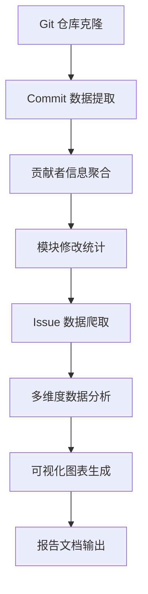

# Evolution 模块 - 仓库演化与社区画像分析

<div align="center">

[](#)
[](#)
[](#)

</div>

## 📋 模块概述

Evolution 模块是 MaxKB_Analysis 框架的第一阶段分析组件，专注于通过**数据驱动的方法**深入挖掘 MaxKB 项目的演化轨迹和社区生态特征。该模块通过对 Git 历史数据的系统性分析，为后续的代码质量和安全分析提供重要的上下文信息。

## 🎯 核心分析维度

### 1. 贡献者生态系统分析 🌟

**分析目标**：全面刻画 MaxKB 社区的贡献者画像和发展趋势

**关键指标**：
- **贡献者集中度**：核心开发者占比分析
- **活跃度分布**：不同贡献者群体的活跃程度
- **新人融入**：新贡献者的加入趋势和留存率
- **贡献模式**：代码、文档、测试等不同类型贡献的比例

**产出成果**：
```json
{
  "core_developers": [
    {"name": "dev1", "commits": 1200, "impact_score": 8.5},
    {"name": "dev2", "commits": 800, "impact_score": 7.2}
  ],
  "community_metrics": {
    "total_contributors": 45,
    "core_team_ratio": "15%",
    "avg_monthly_newcomers": 3.2
  }
}
```

### 2. 模块演化稳定性分析 📈

**分析目标**：识别系统的稳定模块和风险热点区域

**分析方法**：
- 统计各目录/模块的修改频率
- 分析修改模式（重构 vs Bug 修复）
- 识别频繁变更的功能区域
- 评估模块间耦合度变化

**风险预警机制**：
- **高频修改模块**：可能存在的设计缺陷或需求不稳定
- **突发大量修改**：可能的重大重构或紧急修复
- **长期未修改模块**：可能存在技术债或维护盲区

### 3. Issue 生命周期洞察 📊

**分析目标**：评估社区的响应效率和问题解决能力

**关键时序指标**：
- **首次响应时间**：从 Issue 提交到首次回复的时间
- **解决时长分布**：不同类型 Issue 的解决时间统计
- **关闭率趋势**：随时间变化的问题解决效率
- **积压问题分析**：长期未解决 Issue 的分类统计

## 🛠 技术架构与工具链

### 核心依赖工具

| 工具 | 版本 | 用途 | 性能特点 |
|------|------|------|----------|
| PyDriller | 2.5+ | Git 仓库分析 | 高效的提交数据提取 |
| GitPython | 3.1+ | Git 操作接口 | 底层 Git 命令封装 |
| Pandas | 1.5+ | 数据处理分析 | 高性能数据分析 |
| Matplotlib | 3.7+ | 数据可视化 | 丰富的图表类型 |
| Plotly | 5.15+ | 交互式图表 | 现代化可视化效果 |

### 数据处理流程



## 📁 项目结构详解

```
evolution/
├── README.md                          # 本文件 - 模块说明文档
├── scripts/                           # 核心分析脚本
│   ├── fetch_commits.py              # Commit 数据采集器
│   ├── analyze_contributors.py       # 贡献者分析引擎
│   ├── monthly_collector.py          # 月度数据收集器
│   ├── merge_data.py                 # 多源数据融合
│   └── advanced_visualization.py     # 高级可视化工具
├── data/                              # 原始数据存储
│   ├── raw_commits.json              # 原始 Commit 数据
│   ├── contributors_cache.json       # 贡献者缓存数据
│   └── monthly_stats/                # 月度统计结果
├── results/                           # 分析结果输出
│   ├── contributor_analysis/         # 贡献者分析报告
│   │   ├── activity_timeline.json    # 活跃度时间线
│   │   └── impact_matrix.csv         # 影响力矩阵
│   ├── module_stability/             # 模块稳定性报告
│   │   ├── modification_frequency.json # 修改频率统计
│   │   └── risk_hotspots.html        # 风险热点图
│   └── issue_insights/               # Issue 分析报告
│       ├── lifecycle_analysis.json   # 生命周期分析
│       └── response_efficiency.csv   # 响应效率统计
├── visualization/                     # 可视化产出
│   ├── interactive_dashboard/        # 交互式仪表板
│   ├── static_charts/                # 静态图表
│   └── export_formats/               # 导出格式
└── config/                            # 配置文件
    ├── analysis_params.json          # 分析参数配置
    └── visualization_settings.json   # 可视化设置
```

## 🚀 快速开始指南

### 环境准备

```bash
# 1. 安装核心依赖
pip install pydriller gitpython pandas matplotlib plotly seaborn

# 2. 可选：安装高级可视化依赖
pip install dash plotly-express bokeh

# 3. 配置 GitHub Token（推荐）
export GITHUB_TOKEN=your_github_personal_access_token
```

### 基础数据采集

```bash
# 采集指定仓库的 Commit 数据
python scripts/fetch_commits.py \
    --repo https://github.com/1Panel-dev/MaxKB \
    --branch main \
    --since 2023-01-01 \
    --output data/raw_commits.json

# 分析贡献者模式
python scripts/analyze_contributors.py \
    --input data/raw_commits.json \
    --min-commits 10 \
    --output results/contributor_analysis/

# 生成月度统计报告
python scripts/monthly_collector.py \
    --months 12 \
    --granularity weekly \
    --output results/monthly_reports/
```

### 高级分析功能

```bash
# 模块稳定性分析
python scripts/analyze_modules.py \
    --repo-path ../../源代码 \
    --commit-data data/raw_commits.json \
    --output results/module_analysis/

# 多维度数据融合
python scripts/merge_data.py \
    --contributors results/contributor_analysis/activity_timeline.json \
    --modules results/module_analysis/modification_frequency.json \
    --issues results/issue_analysis/lifecycle_data.json \
    --output results/integrated_report.json
```

## 📊 分析结果示例

### 贡献者活跃度分析

```python
# 典型分析结果结构
{
  "temporal_patterns": {
    "peak_activity_months": ["March", "September"],
    "weekend_contribution_rate": 0.23,
    "holiday_activity_drop": 0.45
  },
  "contribution_types": {
    "code_changes": 0.65,
    "documentation": 0.20,
    "testing": 0.15
  },
  "community_health": {
    "bus_factor": 3,
    "new_contributor_retention": 0.38,
    "collaboration_index": 0.72
  }
}
```

### 模块风险评估

```python
# 风险模块识别
HIGH_RISK_MODULES = [
    {
        "module": "apps/application/chat_pipeline",
        "modification_frequency": 45,
        "risk_score": 8.2,
        "reason": "频繁重构，可能存在架构问题"
    },
    {
        "module": "apps/dataset/models",
        "modification_frequency": 32,
        "risk_score": 7.5,
        "reason": "核心数据模型频繁变更"
    }
]
```

## 🎨 可视化展示

### 支持的图表类型

1. **时间序列图**：贡献者活跃度趋势
2. **热力图**：模块修改频率分布
3. **网络图**：贡献者协作关系
4. **箱线图**：Issue 解决时间分布
5. **雷达图**：多维度社区健康度评估

### 交互式仪表板

```python
# 启动本地分析仪表板
python scripts/advanced_visualization.py \
    --data-dir results/ \
    --port 8050 \
    --mode dashboard

# 访问地址：http://localhost:8050
```

## 🔧 配置选项详解

### 分析参数配置

```json
{
  "commit_analysis": {
    "batch_size": 1000,
    "parallel_workers": 4,
    "exclude_merge_commits": true,
    "exclude_bots": ["dependabot", "github-actions"]
  },
  "contributor_metrics": {
    "activity_window_days": 90,
    "min_contributions_for_core": 50,
    "newbie_threshold_commits": 5
  },
  "visualization": {
    "chart_style": "seaborn",
    "dpi": 300,
    "figure_size": [12, 8],
    "color_palette": "viridis"
  }
}
```

### 性能优化建议

```bash
# 内存优化
export PYDRILLER_MULTIPROCESSING=1
export PYTHONHASHSEED=0

# 网络优化（GitHub API）
export GITHUB_API_DELAY=1  # 请求间隔（秒）
export GITHUB_MAX_RETRIES=3  # 最大重试次数
```

## 📈 高级分析技巧

### 趋势预测分析

```python
# 基于历史数据预测未来趋势
from sklearn.linear_model import LinearRegression
import numpy as np

def predict_contribution_trend(historical_data, months_ahead=6):
    """预测未来贡献趋势"""
    X = np.array(range(len(historical_data))).reshape(-1, 1)
    y = np.array(historical_data)
    
    model = LinearRegression()
    model.fit(X, y)
    
    future_X = np.array(range(len(historical_data), 
                             len(historical_data) + months_ahead)).reshape(-1, 1)
    predictions = model.predict(future_X)
    
    return predictions
```

### 异常检测

```python
# 识别异常的贡献模式
from scipy import stats

def detect_anomalous_contributions(contributor_data, threshold=0.05):
    """检测异常贡献行为"""
    contributions = [c['monthly_commits'] for c in contributor_data]
    z_scores = np.abs(stats.zscore(contributions))
    
    anomalies = []
    for i, score in enumerate(z_scores):
        if score > stats.norm.ppf(1 - threshold/2):
            anomalies.append({
                'contributor': contributor_data[i]['name'],
                'z_score': score,
                'anomaly_type': 'high_activity' if contributions[i] > np.mean(contributions) else 'low_activity'
            })
    
    return anomalies
```

## 🤝 与其他模块集成

### 为静态分析提供输入

```python
# 生成静态分析优先级列表
def generate_static_analysis_priority(evolution_results):
    """基于演化分析结果确定静态分析优先级"""
    priority_list = []
    
    # 高频修改模块优先分析
    for module in evolution_results['high_risk_modules']:
        priority_list.append({
            'path': module['module_path'],
            'priority': 'high',
            'reason': f"修改频率: {module['frequency']}/month"
        })
    
    return priority_list
```

### 为模糊测试指导方向

```python
# 识别需要重点测试的模块
def identify_fuzzing_targets(evolution_analysis):
    """基于演化数据确定模糊测试目标"""
    targets = {
        'file_parsing': [],  # 高频修改的文件处理模块
        'api_endpoints': [],  # 新增或频繁变更的API
        'authentication': []  # 权限相关模块变更
    }
    
    # 分析 recent_commits 中涉及的模块
    return targets
```

## 📚 参考资料与延伸阅读

### 学术论文
- [Mining Software Repositories: A Survey](https://ieeexplore.ieee.org/document/6188258)
- [Understanding Developer Contribution Patterns](https://dl.acm.org/doi/10.1145/3236024.3236074)
- [Predicting Software Defects Using Repository Mining](https://ieeexplore.ieee.org/document/5463352)

### 工具文档
- [PyDriller 官方文档](https://pydriller.readthedocs.io/en/latest/)
- [GitPython 使用指南](https://gitpython.readthedocs.io/en/stable/)
- [Pandas 数据分析手册](https://pandas.pydata.org/docs/)

### 最佳实践
- [开源社区健康度评估方法](https://opensource.guide/)
- [软件演化分析模式](https://www.sciencedirect.com/science/article/pii/S0164121219300457)

## ⚠️ 注意事项与限制

### 数据准确性考虑
- Git 历史可能被重写或清理
- 贡献者可能使用多个身份
- 机器生成的提交需要过滤
- 时间戳可能存在时区差异

### 性能约束
- 大型仓库分析可能需要较长时间
- 内存使用量与仓库规模成正比
- GitHub API 有速率限制需要注意
- 建议在非高峰时段运行大规模分析

### 法律合规
- 遵守仓库的 LICENSE 要求
- 尊重贡献者的隐私权
- 符合数据保护法规要求
- 仅用于合法的研究目的

---

<div align="center">

**📊 让数据说话，让演化可见！**

[](../README.md)
[](../static/README.md)

</div>