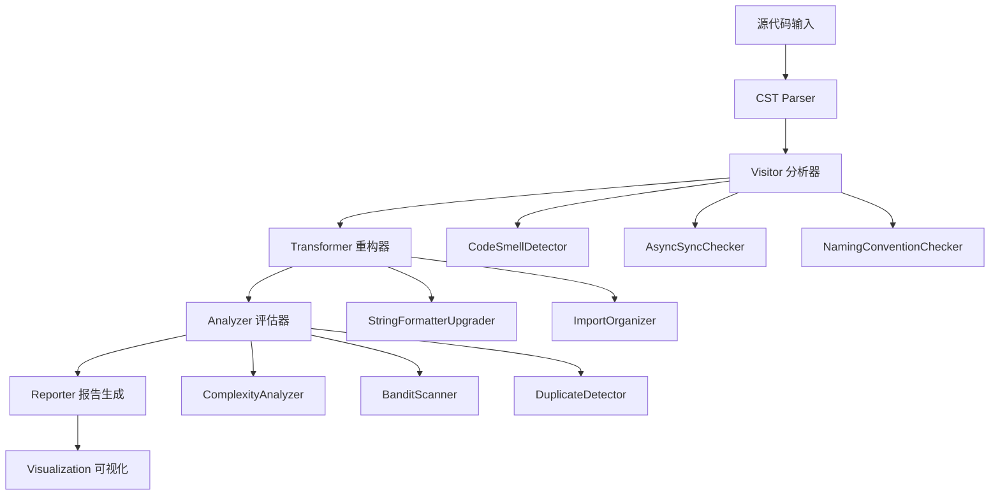

# Static 模块 - 基于 LibCST 的静态代码分析

<div align="center">

[](#)
[](#)
[](#)

</div>

## 📋 模块概述

Static 模块是 MaxKB_Analysis 框架的第二阶段分析组件，基于 Facebook 开源的 [LibCST](https://github.com/Instagram/LibCST) 框架，通过**抽象语法树(AST)级别的精确分析**，在不运行代码的前提下发现 MaxKB 系统中的潜在质量问题、安全漏洞和架构缺陷。

## 🎯 核心分析能力

### 1. 代码异味智能检测 🔍

**检测范围**：
- **异步/同步混用问题**：Django 视图中阻塞调用识别
- **异常处理反模式**：过度宽泛的异常捕获
- **命名规范违规**：不符合 PEP 8 的变量和函数命名
- **代码重复检测**：相似代码块的自动识别
- **资源泄漏风险**：未正确关闭的文件/连接

**检测精度**：
```python
# 典型检测示例
class AsyncSyncChecker(CSTVisitor):
    def visit_Call(self, node: Call) -> None:
        # 检测在异步函数中调用同步阻塞操作
        if self._in_async_context() and self._is_blocking_call(node):
            self.report_issue(
                node, 
                "Async-Sync Mixup", 
                "在异步上下文中调用了同步阻塞方法"
            )
```

### 2. 自动化代码重构 💡

**支持的重构类型**：
- **字符串格式化升级**：`%` 和 `.format()` → f-string
- **导入语句优化**：冗余导入清理、排序标准化
- **API 现代化**：过时方法调用替换
- **类型注解增强**：自动添加类型提示

**重构效果示例**：
```python
# 重构前（旧式写法）
message = "User %s logged in at %s" % (username, timestamp)
errors = "Found {} errors in {}".format(error_count, filename)

# 重构后（现代化写法）
message = f"User {username} logged in at {timestamp}"
errors = f"Found {error_count} errors in {filename}"
```

### 3. 复杂度深度分析 📊

**分析维度**：
- **圈复杂度(Cyclomatic Complexity)**：控制流复杂度测量
- **认知复杂度(Cognitive Complexity)**：人类理解难度评估
- **嵌套深度分析**：代码层级结构复杂度
- **函数长度统计**：LOC (Lines of Code) 分布

**重点关注模块**：
```python
HIGH_COMPLEXITY_TARGETS = [
    "apps/application/chat_pipeline/",    # 对话处理管道
    "apps/dataset/models/",               # 数据模型定义
    "apps/embedding/vector/",             # 向量计算模块
    "apps/common/chunk/",                 # 文本分块处理
]
```

## 🛠 技术架构详解

### LibCST 核心概念

#### Visitor 模式
用于**只读遍历**代码树结构，适用于检测和分析：
```python
from libcst import CSTVisitor, FunctionDef, SimpleStatementLine

class CodeSmellDetector(CSTVisitor):
    def __init__(self):
        self.issues = []
        
    def visit_FunctionDef(self, node: FunctionDef) -> None:
        # 检测函数级别的代码异味
        if self._has_too_many_parameters(node):
            self.issues.append({
                'type': 'TooManyParameters',
                'location': self._get_location(node),
                'severity': 'warning'
            })
    
    def visit_SimpleStatementLine(self, node: SimpleStatementLine) -> None:
        # 检测语句级别的问题
        pass
```

#### Transformer 模式
用于**修改**代码树结构，实现自动化重构：
```python
from libcst import CSTTransformer, FormattedString, SimpleString

class StringFormatterUpgrader(CSTTransformer):
    def leave_SimpleString(self, original_node, updated_node):
        # 将旧式字符串格式化转换为 f-string
        if self._can_upgrade_to_fstring(original_node):
            return self._convert_to_fstring(original_node)
        return updated_node
```

### 分析器组件架构



## 📁 项目结构与组件

```
static/
├── README.md                          # 本文件 - 模块说明文档
├── visitors/                          # LibCST 访问器组件
│   ├── __init__.py
│   ├── code_smell_detector.py        # 综合代码异味检测器
│   ├── async_sync_checker.py         # 异步同步混用检查器
│   ├── naming_convention_checker.py  # 命名规范检查器
│   └── exception_handler_checker.py  # 异常处理检查器
├── transformers/                      # LibCST 转换器组件
│   ├── __init__.py
│   ├── string_formatter_upgrade.py   # 字符串格式化升级器
│   ├── import_organizer.py           # 导入语句整理器
│   └── api_modernizer.py             # API 现代化转换器
├── analyzers/                         # 独立分析器组件
│   ├── __init__.py
│   ├── complexity_analyzer.py        # 复杂度分析器
│   ├── bandit_scanner.py             # 安全漏洞扫描器
│   ├── duplicate_detector.py         # 代码重复检测器
│   └── visualizer.py                 # 结果可视化器
├── results/                           # 分析结果存储
│   ├── code_smells/
│   │   ├── issues_report.json        # 代码异味详细报告
│   │   └── severity_summary.csv      # 严重程度统计
│   ├── complexity/
│   │   ├── cyclomatic_report.json    # 圈复杂度报告
│   │   └── cognitive_analysis.html   # 认知复杂度分析
│   ├── security/
│   │   ├── bandit_findings.json      # 安全扫描结果
│   │   └── vulnerability_heatmap.png # 漏洞热力图
│   └── refactored/                   # 自动重构输出
│       ├── upgraded_strings/         # 升级后的代码
│       └── import_optimized/         # 优化后的导入
├── config/                            # 配置文件
│   ├── analysis_rules.json           # 分析规则配置
│   └── refactoring_preferences.json  # 重构偏好设置
└── tests/                             # 测试用例
    ├── test_visitors.py
    ├── test_transformers.py
    └── test_analyzers.py
```

## 🚀 快速开始与使用

### 环境配置

```bash
# 1. 安装核心依赖
pip install libcst flake8 bandit radon astroid

# 2. 安装可选依赖（增强功能）
pip install colorama rich tqdm plotly

# 3. 验证安装
python -c "import libcst, flake8, bandit; print('✓ 静态分析环境配置完成')"
```

### 基础分析命令

```bash
# 1. 执行综合代码异味检测
python -m visitors.code_smell_detector \
    --path ../../源代码/apps \
    --output results/code_smells/issues_report.json \
    --format json,html

# 2. 运行安全漏洞扫描
python -m analyzers.bandit_scanner \
    --path ../../源代码/apps \
    --severity high \
    --confidence medium \
    --output results/security/bandit_findings.json

# 3. 复杂度分析
python -m analyzers.complexity_analyzer \
    --path ../../源代码/apps \
    --threshold 15 \
    --exclude-tests \
    --output results/complexity/report.json
```

### 自动化重构功能

```bash
# 1. 字符串格式化升级（预览模式）
python -m transformers.string_formatter_upgrade \
    --path ../../源代码/apps \
    --dry-run \
    --output-preview results/refactored/string_preview.html

# 2. 执行重构（生成新文件）
python -m transformers.string_formatter_upgrade \
    --path ../../源代码/apps \
    --output-dir results/refactored/upgraded_strings/ \
    --backup-original

# 3. 导入语句优化
python -m transformers.import_organizer \
    --path ../../源代码/apps \
    --sort-standard-library-first \
    --group-by-type \
    --remove-unused
```

### 高级分析组合

```bash
# 批量执行所有分析
python run_complete_analysis.py \
    --source-path ../../源代码/apps \
    --output-dir results/comprehensive_analysis/ \
    --include-all-checks \
    --generate-dashboard

# 生成交互式分析仪表板
python -m analyzers.visualizer \
    --input-dir results/ \
    --output-dashboard results/dashboard.html \
    --port 8080
```

## 📊 分析结果详解

### 代码异味报告结构

```json
{
  "scan_metadata": {
    "timestamp": "2024-02-15T21:00:00Z",
    "total_files": 156,
    "lines_analyzed": 45230
  },
  "issues_by_category": {
    "async_sync_mixup": {
      "count": 12,
      "severity_distribution": {"high": 8, "medium": 4},
      "examples": [
        {
          "file": "apps/application/views.py",
          "line": 45,
          "issue": "在异步视图中调用同步数据库查询",
          "suggestion": "使用 await 或改为异步 ORM 查询"
        }
      ]
    },
    "exception_handling": {
      "count": 23,
      "severity_distribution": {"medium": 15, "low": 8}
    }
  },
  "recommendations": [
    "优先修复高严重性的异步同步混用问题",
    "统一异常处理模式，避免裸露的 except:",
    "考虑引入类型注解提升代码可读性"
  ]
}
```

### 复杂度分析报告

```python
# 复杂度排名示例
COMPLEXITY_RANKING = [
    {
        "function": "ChatPipeline.process_message",
        "file": "apps/application/chat_pipeline/main.py",
        "cyclomatic_complexity": 28,
        "cognitive_complexity": 18,
        "lines_of_code": 156,
        "maintainability_rating": "D"
    },
    {
        "function": "VectorStore.similarity_search",
        "file": "apps/embedding/vector/store.py",
        "cyclomatic_complexity": 22,
        "cognitive_complexity": 15,
        "maintainability_rating": "C"
    }
]
```

## 🎨 可视化功能

### 支持的图表类型

1. **复杂度热力图**：函数复杂度分布可视化
2. **异味分布饼图**：各类代码异味占比
3. **趋势折线图**：随时间的质量改善趋势
4. **依赖关系图**：模块间耦合度分析
5. **重构效益图**：自动化重构前后的对比

### 交互式仪表板

```python
# 启动本地分析仪表板
from analyzers.visualizer import AnalysisDashboard

dashboard = AnalysisDashboard(
    data_directory="results/",
    port=8080,
    auto_reload=True
)
dashboard.run_server(debug=True)
```

## 🔧 高级配置选项

### 自定义分析规则

```json
{
  "code_smell_rules": {
    "max_function_parameters": 8,
    "max_nested_blocks": 5,
    "min_variable_name_length": 2,
    "allowed_naming_patterns": [
      "snake_case",
      "UPPER_CASE_CONSTANTS"
    ]
  },
  "complexity_thresholds": {
    "cyclomatic_warning": 10,
    "cyclomatic_critical": 20,
    "cognitive_warning": 8,
    "cognitive_critical": 15
  },
  "refactoring_preferences": {
    "prefer_f_string": true,
    "sort_imports_alphabetically": true,
    "group_stdlib_imports": true,
    "add_type_hints": false
  }
}
```

### 性能优化配置

```python
# 并行处理配置
PARALLEL_CONFIG = {
    "max_workers": 4,
    "chunk_size": 50,
    "memory_limit_mb": 2048,
    "timeout_seconds": 300
}

# 缓存策略
CACHE_CONFIG = {
    "enable_parsing_cache": True,
    "cache_directory": ".cst_cache/",
    "max_cache_size_gb": 1.0
}
```

## 🤝 与其他模块集成

### 基于演化分析结果的定向分析

```python
# 结合 evolution 模块的结果进行精准分析
def targeted_static_analysis(evolution_results):
    """基于演化分析结果确定静态分析重点"""
    
    # 优先分析高频修改的模块
    high_risk_modules = evolution_results['high_risk_modules']
    
    analysis_config = {
        'paths': [module['path'] for module in high_risk_modules],
        'depth': 'deep',  # 深度分析
        'checks': ['all'],  # 启用所有检查
        'threshold': 'low'  # 降低阈值捕获更多问题
    }
    
    return run_static_analysis(analysis_config)
```

### 为模糊测试提供质量基线

```python
# 生成模糊测试的质量基线报告
def generate_fuzzing_baseline(static_analysis_results):
    """为模糊测试提供代码质量基线"""
    
    baseline = {
        'complexity_metrics': static_analysis_results['complexity'],
        'known_vulnerabilities': static_analysis_results['security']['high_severity'],
        'code_smells': static_analysis_results['code_smells'],
        'recommended_fuzzing_targets': identify_unstable_functions(static_analysis_results)
    }
    
    return baseline
```

## 📚 最佳实践与建议

### 分析策略建议

1. **渐进式分析**：先运行基础检查，再逐步启用高级分析
2. **重点关注区域**：优先分析 evolution 阶段识别的高风险模块
3. **定期扫描**：建立 CI/CD 集成，持续监控代码质量
4. **人工复核**：自动化工具的结果需要专家评审确认

### 重构实施建议

1. **小步快跑**：每次重构限定在可控范围内
2. **充分测试**：重构前后都要运行完整测试套件
3. **版本控制**：使用 Git 进行增量提交，便于回滚
4. **团队共识**：重要的重构决策需要团队讨论

## 📚 参考资源

### 官方文档
- [LibCST 官方文档](https://libcst.readthedocs.io/)
- [Flake8 代码风格检查](https://flake8.pycqa.org/)
- [Bandit 安全扫描器](https://bandit.readthedocs.io/)
- [Radon 复杂度分析](https://radon.readthedocs.io/)

### 学术资源
- [静态程序分析基础](https://cs.au.dk/~amoeller/spa/)
- [代码异味检测综述](https://ieeexplore.ieee.org/document/6188258)
- [软件复杂度测量方法](https://ieeexplore.ieee.org/document/1703110)

### 行业标准
- [PEP 8 Python 代码规范](https://peps.python.org/pep-0008/)
- [OWASP 安全编码实践](https://owasp.org/www-project-code-review-guide/)
- [Clean Code 原则](https://github.com/ryanmcdermott/clean-code-javascript)

## ⚠️ 注意事项

### 工具局限性
- 静态分析无法发现运行时才能暴露的问题
- 某些"异味"可能是业务需求导致的合理设计
- 自动重构可能改变代码语义，需要仔细验证

### 性能考虑
- 大型代码库分析可能消耗较多内存和时间
- 建议分模块逐步分析，避免一次性处理过多文件
- 可以通过配置文件调整分析深度和广度

### 结果解释
- 工具报告的问题需要结合具体业务场景判断
- 不同工具可能对同一问题给出不同评级
- 建议建立团队内部的质量标准和接受准则

---

<div align="center">

**🔍 精准分析，智能重构，持续改进！**

[](../evolution/README.md)
[](../fuzzing/README.md)

</div>