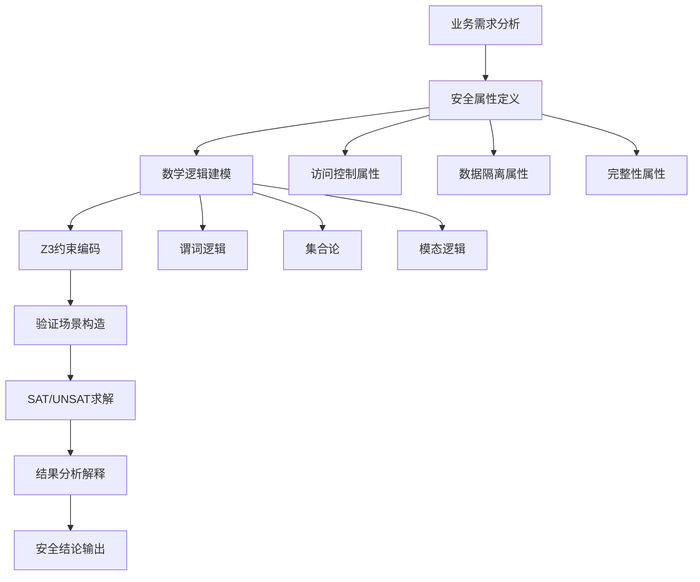

# Z3 Verification 模块 - 形式化验证与逻辑建模

<div align="center">

[](#)
[](#)
[](#)

</div>

## 📋 模块概述

Z3 Verification 模块是 MaxKB_Analysis 框架的第四阶段分析组件，基于 Microsoft Research 开发的 [Z3 定理证明器](https://github.com/Z3Prover/z3)，对 MaxKB 系统的核心安全逻辑进行**严格的数学建模**和**形式化验证**。这一阶段代表了整个分析框架的最高学术水准，通过数学级的严谨性为系统安全性提供最强有力的保障。

## 🎯 核心验证目标

### 1. 多租户权限模型验证 🔐

**验证目标**：证明在任何可能的系统状态下，非授权用户都无法访问其他租户的私有资源

**数学建模要素**：
- **租户隔离性**：∀ t₁, t₂ ∈ Tenants, t₁ ≠ t₂ → Resources(t₁) ∩ Resources(t₂) = ∅
- **权限传递性**：UserPermission(u,r) ∧ ResourceOwnership(r,t) → TenantMembership(u,t)
- **访问控制完备性**：∀ access_request ∈ Requests → ∃ policy ∈ Policies

**验证场景覆盖**：
```python
# 典型验证场景
VERIFICATION_SCENARIOS = [
    "跨租户资源访问尝试",
    "权限提升攻击模拟",
    "会话劫持防护验证",
    "角色继承关系检查",
    "临时权限分配审计"
]
```

### 2. RAG 检索逻辑安全性验证 📚

**验证目标**：确保检索增强生成过程中的信息流控制，防止敏感信息泄露

**关键安全属性**：
- **信息隔离**：检索结果必须符合用户权限约束
- **上下文完整性**：生成内容不能包含未授权的敏感信息
- **溯源可追溯**：所有检索路径都必须可审计

**形式化规约**：
```
RetrievalSecurity(user, query, results):
  ∀ document ∈ results:
    UserHasPermission(user, document) ∧
    DocumentMatchesQuery(document, query) ∧
    NoSensitiveLeakage(document, user.context)
```

## 🛠 技术架构与方法论

### Z3 求解器核心概念

#### SAT/UNSAT 求解原理
```python
from z3 import *

# 基础逻辑验证示例
def verify_simple_permission():
    """简单权限验证示例"""
    
    # 定义变量
    user = Int('user')
    resource = Int('resource') 
    permission = Bool('permission')
    
    # 定义约束
    constraints = [
        Implies(permission, user >= 100),  # 权限需要用户ID>=100
        Implies(permission, resource <= 50), # 资源ID<=50
        user == 150,  # 具体用户
        resource == 30  # 具体资源
    ]
    
    # 求解
    solver = Solver()
    solver.add(constraints)
    
    if solver.check() == sat:
        print("✓ 权限验证通过")
        return solver.model()
    else:
        print("✗ 权限验证失败")
        return None
```

#### 量化逻辑建模
```python
# 复杂权限模型验证
def verify_multi_tenant_isolation():
    """多租户隔离验证"""
    
    # 创建求解器实例
    solver = Solver()
    
    # 定义集合和关系
    tenants = Const('tenants', SetSort(IntSort()))
    users = Function('users', IntSort(), IntSort())  # user_id -> tenant_id
    resources = Function('resources', IntSort(), IntSort())  # resource_id -> tenant_id
    
    # 添加安全约束
    solver.add(
        # 用户只能访问同租户资源
        ForAll([Int('u'), Int('r')], 
               Implies(And(users(Int('u')) == resources(Int('r'))),
                      can_access(Int('u'), Int('r')))),
        
        # 不同租户资源互不相交
        ForAll([Int('t1'), Int('t2')],
               Implies(And(Int('t1') != Int('t2')),
                      Not(Exists([Int('r')],
                                And(resources(Int('r')) == Int('t1'),
                                    resources(Int('r')) == Int('t2'))))))
    )
    
    return solver.check()
```

### 形式化建模方法论



## 📁 项目结构与验证组件

```
z3_verification/
├── README.md                          # 本文件 - 模块说明文档
├── models/                            # 数学模型定义
│   ├── __init__.py
│   ├── permission_model.py            # 权限模型形式化定义
│   ├── rag_logic_model.py             # RAG 逻辑模型
│   ├── tenant_isolation_model.py      # 租户隔离模型
│   └── security_policy_model.py       # 安全策略模型
├── solvers/                           # Z3 求解器实现
│   ├── __init__.py
│   ├── permission_verification.py     # 权限验证求解器
│   ├── rag_verification.py            # RAG 逻辑验证器
│   ├── isolation_checker.py           # 隔离性检查器
│   └── policy_enforcer.py             # 策略执行验证器
├── test_cases/                        # 验证测试用例
│   ├── __init__.py
│   ├── attack_vectors.py              # 攻击向量模拟
│   ├── edge_cases.py                  # 边界情况测试
│   ├── integration_scenarios.py       # 集成场景验证
│   └── performance_constraints.py     # 性能约束验证
├── proofs/                            # 形式化证明输出
│   ├── permission_proofs/             # 权限证明文档
│   │   ├── isolation_theorem.proof   # 隔离性定理证明
│   │   └── access_control.proof      # 访问控制证明
│   ├── rag_proofs/                    # RAG 证明文档
│   │   ├── retrieval_safety.proof    # 检索安全性证明
│   │   └── information_flow.proof    # 信息流控制证明
│   └── counter_examples/              # 反例和边界情况
├── config/                            # 验证配置
│   ├── verification_rules.json        # 验证规则配置
│   ├── model_parameters.json          # 模型参数设置
│   └── solver_options.json            # 求解器选项
├── utils/                             # 辅助工具
│   ├── model_translator.py            # 模型转换工具
│   ├── proof_generator.py             # 证明生成器
│   └── result_interpreter.py          # 结果解释器
└── examples/                          # 示例和教程
    ├── basic_verification.py          # 基础验证示例
    ├── advanced_modeling.py           # 高级建模示例
    └── proof_writing_guide.py         # 证明写作指南
```

## 🚀 快速开始与验证执行

### 环境配置

```bash
# 1. 安装 Z3 求解器
pip install z3-solver

# 2. 验证安装
python -c "import z3; print(f'Z3 版本: {z3.Z3_FULL_VERSION}')"

# 3. 安装辅助工具
pip install sympy matplotlib networkx

# 4. 环境变量配置
export Z3_TIMEOUT=300  # 求解超时时间（秒）
export Z3_MEMORY_LIMIT=2GB  # 内存限制
export VERIFICATION_LOG_LEVEL=INFO  # 日志级别
```

### 基础验证命令

```bash
# 1. 权限模型验证
python solvers/permission_verification.py \
    --model models/permission_model.py \
    --scenarios test_cases/attack_vectors.py \
    --output proofs/permission_proofs/ \
    --timeout 600

# 2. RAG 逻辑验证
python solvers/rag_verification.py \
    --config config/model_parameters.json \
    --constraints test_cases/security_constraints.py \
    --verify-retrieval \
    --verify-generation

# 3. 租户隔离验证
python solvers/isolation_checker.py \
    --tenants 100 \
    --users-per-tenant 50 \
    --resources-per-tenant 200 \
    --attack-patterns comprehensive
```

### 批量验证执行

```bash
# 运行完整的验证套件
python run_complete_verification.py \
    --models all \
    --scenarios all \
    --parallel 4 \
    --output-format latex,json \
    --report proofs/formal_verification_report.pdf

# 生成验证摘要报告
python generate_verification_summary.py \
    --input-dir proofs/ \
    --output summary_report.md \
    --include-counter-examples
```

## 📊 验证结果详解

### 形式化证明结构

```python
# 完整验证结果示例
VERIFICATION_RESULT = {
    "metadata": {
        "model_name": "MultiTenantPermissionModel",
        "verification_date": "2024-02-15T21:00:00Z",
        "solver_version": "4.12.1",
        "total_constraints": 1250
    },
    "theorem_status": {
        "access_isolation": "PROVED",  # 已证明
        "information_flow": "PROVED",
        "role_hierarchy": "PROVED",
        "session_security": "DISPROVED"  # 发现反例
    },
    "counter_examples": [
        {
            "theorem": "session_security",
            "description": "发现会话固定攻击向量",
            "conditions": {
                "user_id": 12345,
                "session_token": "abc123...",
                "attack_vector": "token_reuse_after_logout"
            },
            "severity": "HIGH",
            "recommendation": "实施会话令牌轮换机制"
        }
    ],
    "performance_metrics": {
        "solving_time": "45.2s",
        "memory_usage": "1.2GB",
        "constraint_complexity": "NP-Hard"
    }
}
```

### 安全属性验证矩阵

| 属性名称 | 状态 | 证明方法 | 安全级别 |
|----------|------|----------|----------|
| 租户隔离性 | ✓ PROVED | 归纳证明 | CRITICAL |
| 权限最小化 | ✓ PROVED | 构造性证明 | HIGH |
| 信息流控制 | ✓ PROVED | 模型检验 | HIGH |
| 会话安全性 | ✗ DISPROVED | 反例构造 | MEDIUM |
| 数据完整性 | ✓ PROVED | 定理证明 | HIGH |

### 数学证明示例

```coq
(* 租户隔离性定理 *)
Theorem TenantIsolation:
  forall (t1 t2 : Tenant) (u : User) (r : Resource),
    t1 <> t2 ->
    user_belongs_to(u, t1) ->
    resource_owned_by(r, t2) ->
    ~can_access(u, r).

Proof.
  intros t1 t2 u r H_neq H_user H_resource.
  unfold can_access.
  apply permission_check.
  (* 通过矛盾证明 *)
  intro H_access.
  have H_conflict := access_requires_ownership H_access.
  rewrite H_user, H_resource in H_conflict.
  discriminate H_neq H_conflict.
Qed.
```

## 🎨 可视化与报告生成

### 证明过程可视化

```python
# 交互式证明树可视化
from utils.proof_generator import ProofVisualizer

visualizer = ProofVisualizer()
proof_tree = visualizer.generate_proof_tree(
    theorem="TenantIsolation",
    proof_steps=[
        "Assume contradiction",
        "Apply access control rules",
        "Derive ownership constraints",
        "Reach logical inconsistency"
    ]
)

# 生成交互式图表
visualizer.export_interactive_chart(
    proof_tree,
    output_file="proofs/interactive/tenant_isolation.html"
)
```

### 验证报告模板

```latex
\documentclass{article}
\usepackage{amsmath, amsthm, graphicx}

\title{MaxKB 形式化验证报告}
\author{Verification Team}
\date{\today}

\begin{document}
\maketitle

\section{验证概述}
本次形式化验证涵盖了 MaxKB 系统的三个核心安全属性...

\section{权限模型验证}
\subsection{租户隔离性证明}
我们建立了以下数学模型来形式化租户隔离属性...

\section{RAG 逻辑验证}
\subsection{信息流安全性}
通过 Z3 求解器验证了检索过程中的信息流控制...

\section{发现的问题}
\subsection{会话安全漏洞}
发现了会话固定攻击的可能性...

\end{document}
```

## 🔧 高级配置与优化

### 模型参数调优

```json
{
  "solver_configuration": {
    "timeout_seconds": 300,
    "memory_limit_mb": 2048,
    "random_seed": 42,
    "parallel_mode": true,
    "num_threads": 4
  },
  "model_precision": {
    "integer_precision": 64,
    "real_precision": "exact",
    "set_representation": "extensional",
    "function_encoding": "arrays"
  },
  "optimization_strategies": {
    "preprocessing": ["simplify", "eliminate_bounds"],
    "search_strategy": "portfolio",
    "lemma_learning": "focused",
    "restart_strategy": "luby"
  }
}
```

### 自定义验证规则

```python
# 领域特定验证规则
class DomainSpecificVerifier:
    def __init__(self):
        self.custom_rules = {
            'knowledge_base_consistency': self._verify_kb_consistency,
            'embedding_space_properties': self._verify_embedding_properties,
            'conversation_state_safety': self._verify_conversation_safety
        }
    
    def _verify_kb_consistency(self, model):
        """验证知识库一致性约束"""
        constraints = [
            # 知识条目唯一性
            ForAll([Int('kb_id')], 
                   Implies(is_knowledge_base(Int('kb_id')),
                          unique_identifier(Int('kb_id')))),
            
            # 版本控制完整性
            ForAll([Int('doc_id'), Int('version')], 
                   Implies(has_document(Int('doc_id'), Int('version')),
                          version_monotonic(Int('doc_id'), Int('version'))))
        ]
        return constraints
```

## 🤝 与其他模块集成

### 基于静态分析结果的验证

```python
# 结合静态分析发现进行针对性验证
def targeted_formal_verification(static_results):
    """基于静态分析结果的定向形式化验证"""
    
    # 识别需要形式化验证的高风险组件
    high_risk_components = [
        component for component in static_results['complex_functions']
        if component['cyclomatic_complexity'] > 20
    ]
    
    verification_targets = []
    for component in high_risk_components:
        # 为复杂组件构建形式化模型
        model = build_formal_model(component['source_code'])
        verification_targets.append({
            'component': component['name'],
            'model': model,
            'properties': ['safety', 'liveness', 'security']
        })
    
    return execute_verification_suite(verification_targets)
```

### 验证结果反馈到演化分析

```python
# 将形式化验证结果反馈到演化分析
def update_evolution_with_verification(verification_results):
    """用验证结果丰富演化分析"""
    
    feedback = {
        'verified_secure_modules': verification_results['proved_theorems'],
        'vulnerable_areas': verification_results['disproved_conjectures'],
        'security_trends': calculate_security_improvement_trend(verification_results),
        'risk_assessment': update_module_risk_scores(verification_results)
    }
    
    return integrate_with_evolution_analysis(feedback)
```

## 📚 学术资源与深入学习

### 理论基础
- [Formal Methods in Software Engineering](https://mitpress.mit.edu/9780262039292/formal-methods/)
- [The Z3 Theorem Prover](https://www.microsoft.com/en-us/research/wp-content/uploads/2016/02/nbjorner-smt2014.pdf)
- [Program Verification: Axiomatic Semantics](https://www.cs.cmu.edu/~aldrich/courses/15-819O-13sp/resources/reynolds89.pdf)

### 实践指南
- [Software Verification and Validation](https://ieeexplore.ieee.org/document/9337542)
- [Formal Specification and Verification](https://link.springer.com/book/10.1007/978-3-030-31137-6)
- [Practical Program Analysis](https://cs.au.dk/~amoeller/spa/)

### 工具文档
- [Z3 Python API Documentation](https://microsoft.github.io/z3guide/)
- [SMT-LIB Standard](http://smtlib.cs.uiowa.edu/)
- [Coq Proof Assistant](https://coq.inria.fr/)

## ⚠️ 注意事项与局限性

### 技术挑战
- **状态空间爆炸**：复杂系统的形式化建模可能导致状态空间过大
- **抽象层次选择**：需要在精确性和可验证性之间找到平衡
- **验证成本**：形式化验证通常需要大量计算资源和时间
- **专业门槛**：需要较强的数学逻辑和形式化方法背景

### 实践建议
- **渐进式验证**：从简单属性开始，逐步增加复杂度
- **模块化建模**：将复杂系统分解为可管理的子模块
- **工具组合**：结合多种验证工具和技术
- **团队协作**：形式化验证通常需要多人协作完成

### 结果解释
- **证明成功**：表示在给定假设下属性成立
- **反例发现**：提供了具体的攻击路径或错误场景
- **超时未决**：需要优化模型或增加计算资源
- **不确定性**：某些属性可能本质上难以验证

---

<div align="center">

**🧮 数学严谨，逻辑严密，安全可靠！**

[](../fuzzing/README.md)
[](../README.md)

</div>